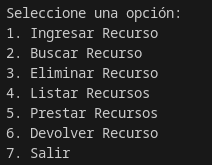
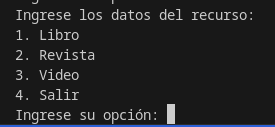
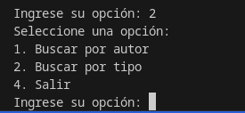

# IPC2_Tarea1VD_202300625

## Descripción del Proyecto

Este proyecto es una aplicación de gestión de una biblioteca que permite a los usuarios ingresar, buscar, eliminar, listar, prestar y devolver recursos como libros, revistas y videos.

## Estructura del Proyecto

- `main.py`: Archivo principal que contiene el menú y la lógica del programa.
- `libro.py`: Contiene la clase `Libro`.
- `revista.py`: Contiene la clase `Revista`.
- `video.py`: Contiene la clase `Video`.
- `recursos.py`: Contiene la clase `Recursos`.
- `biblioteca.py`: Contiene la clase `Biblioteca`.

## Instalación

1. Clona el repositorio:
    ```bash
    git clone <URL_DEL_REPOSITORIO>
    ```
2. Navega al directorio del proyecto:
    ```bash
    cd IPC2_Tarea1VD_202300625
    ```

## Uso

Para ejecutar el programa, simplemente corre el archivo `main.py`:
```bash
python main.py
```

## Funcionalidades

### Menú Principal

1. **Ingresar Recurso**: Permite ingresar un nuevo recurso (libro, revista o video) a la biblioteca.
2. **Buscar Recurso**: Permite buscar recursos por autor o tipo.
3. **Eliminar Recurso**: Permite eliminar un recurso de la biblioteca.
4. **Listar Recursos**: Muestra todos los recursos disponibles en la biblioteca.
5. **Prestar Recursos**: Permite prestar un recurso de la biblioteca.
6. **Devolver Recurso**: Permite devolver un recurso prestado.
7. **Salir**: Sale del programa.



### Menú Ingresar Recurso

1. **Libro**: Permite ingresar un nuevo libro.
2. **Revista**: Permite ingresar una nueva revista.
3. **Video**: Permite ingresar un nuevo video.
4. **Salir**: Vuelve al menú principal.



### Menú Buscar Recurso

1. **Buscar por autor**: Permite buscar recursos por autor.
2. **Buscar por tipo**: Permite buscar recursos por tipo.
3. **Salir**: Vuelve al menú principal.


## Ejemplo de Uso

1. Ejecuta el programa:
    ```bash
    python main.py
    ```
2. Selecciona la opción "1. Ingresar Recurso" para agregar un nuevo recurso.
3. Sigue las instrucciones para ingresar los datos del recurso.
4. Utiliza las demás opciones del menú para gestionar los recursos de la biblioteca.

## Uso POO

### Clase Principal
``` python

class Biblioteca:
    def __init__(self):
        self.recursos = []

    def agregarRecurso(self, recurso):
        self.recursos.append(recurso)
    
    def mostrarRecursosDisponibles(self):
        for recurso in self.recursos:
            recurso.informacionDetallada()

    def buscarPorAutor(self, autor):
        for recurso in self.recursos:
            if recurso.autor == autor:
                recurso.informacionDetallada()

    def buscarPorTipo(self, tipo):
        for recurso in self.recursos:
            if recurso.tipo == tipo:
                recurso.informacionDetallada()
    
    def eliminarRecurso(self, recurso):
        for recurso in self.recursos:
            if recurso.titulo == recurso:
                if recurso.disponibilidad == False:
                    print("No se puede eliminar el recurso porque esta prestado")
                    return
                self.recursos.remove(recurso)
                print("Recurso eliminado")
                return
        print("No se encontro el recurso")
    
    def prestarRecurso(self, recurso):
        for recurso in self.recursos:
            if recurso.titulo == recurso:
                recurso.prestar()
                return
        print("No se encontro el recurso")

    def devolverRecurso(self, recurso):
        for recurso in self.recursos:
            if recurso.titulo == recurso:
                recurso.devolver()
                return
        print("No se encontro el recurso")   

``` 
 
 ### Clase padre: recursos

 ```python

class Recursos:
    def __init__(self, valor, titulo, autor, anoPublicacion, disponibilidad):
            self.titulo = titulo
            self.autor = autor
            self.anoPublicacion = anoPublicacion
            self.disponibilidad = disponibilidad
            self.valor = valor

    def informacionDetallada(self):
        self.valor.informacionDetallada()

    def prestar(self):
        self.cabeza.disponibilidad = False

    def devolver(self):
        self.cabeza.disponibilidad = True

 ```

 ### Clase hijo: libro

 ```python

class Libro:
    def __init__(self, genero, numeroPaginas):
        self.genero = genero
        self.numeroPaginas = numeroPaginas

    def informacionDetallada(self):
        print("-----------------------------")
        print("|Recurso:\t\t\t|Libro\t\t\t|")
        print("|Genero:\t\t\t|" + self.genero + "\t\t\t|", "\n|Numero de paginas:\t\t|" + self.numeroPaginas + "\t\t\t|")
        print("-----------------------------")

 ```

 ### Clase hijo: revista

 ```python

class Revista: 
    def __intit__(self, numeroEdicion, frecuenciaPublicacion):
        self.numeroEdicion = numeroEdicion
        self.frecuenciaPublicacion = frecuenciaPublicacion

    def informacionDetallada(self):
        print("-----------------------------")
        print("|Recurso:\t\t\t|Revista\t\t\t|")
        print("|Numero de edicion:\t\t\t|" + self.numeroEdicion + "\t\t\t|", "\n|Frecuencia de publicacion:\t" + self.frecuenciaPublicacion + "\t\t\t|")
        print("-----------------------------")

 ```

 ### Clase hijo: video

 ```python

class Video: 
    def __init__(self, duracion, formato):
        self.duracion = duracion
        self.formato = formato

    def informacionDetallada(self):
        print("-----------------------------")
        print("|Recurso:\t\t\t|Video\t\t\t|")
        print("|Duracion:\t\t\t|" + self.duracion + "\t\t\t|", "\n|Formato:\t\t\t|" + self.formato + "\t\t\t|")
        print("-----------------------------")

 ```


